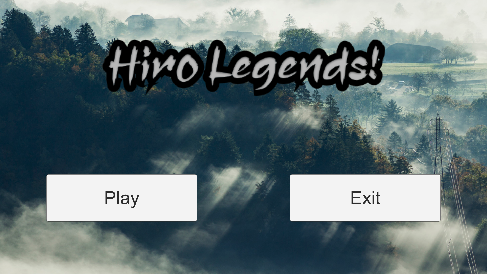
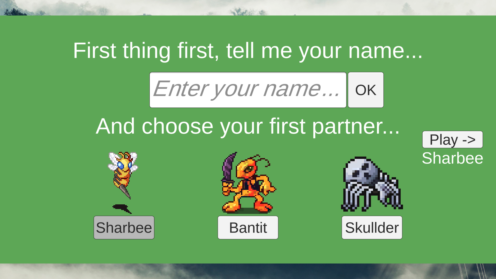
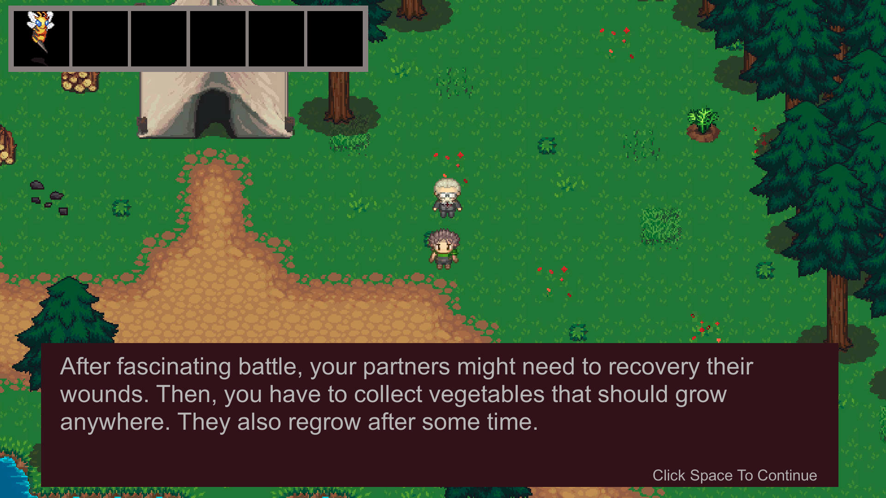
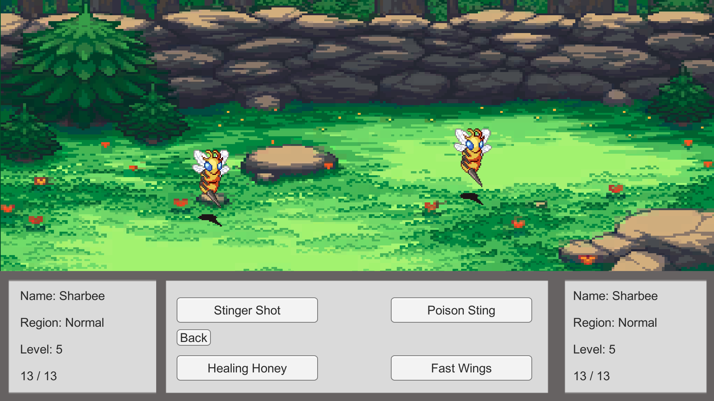
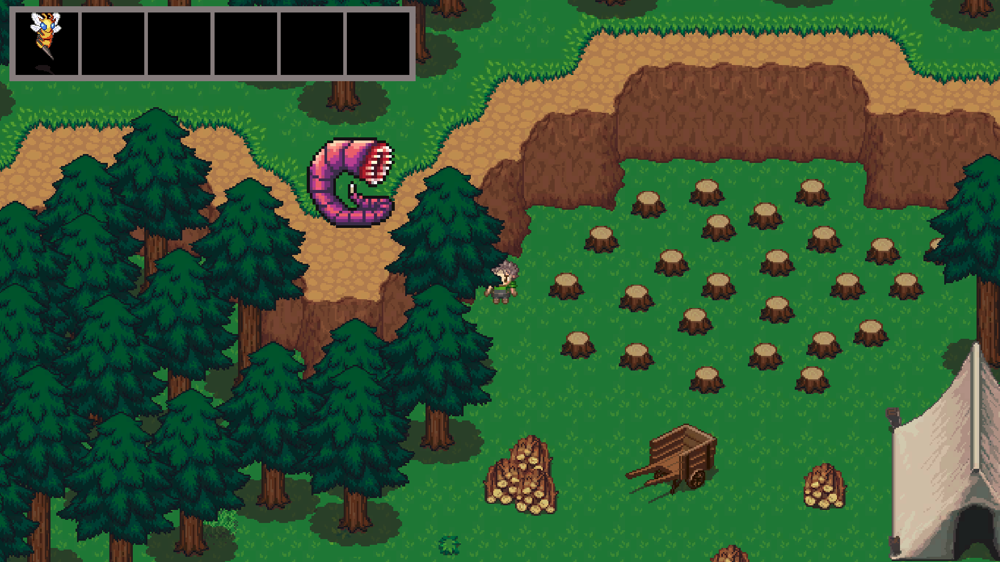
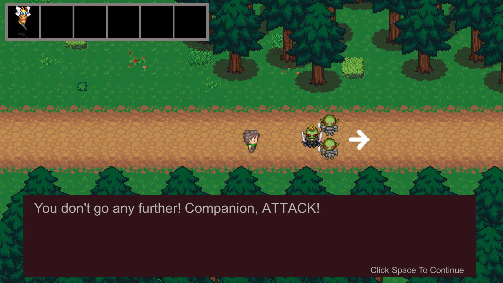
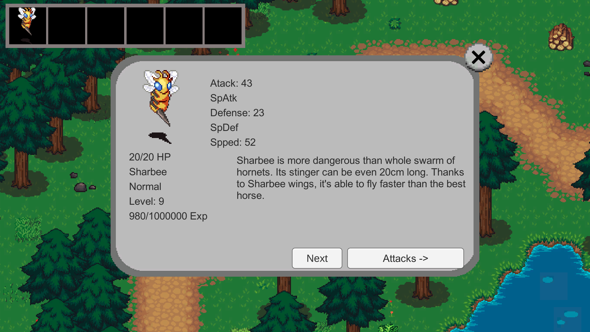
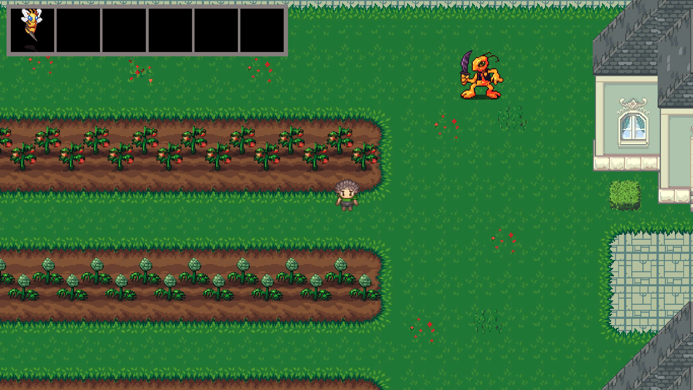
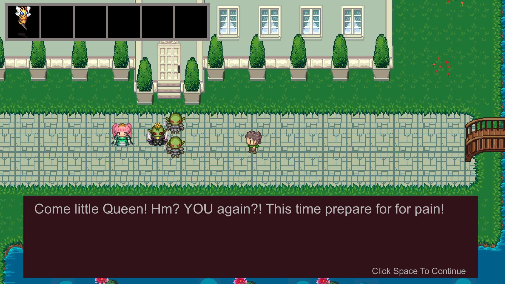

# Hiro Legends

This project was created around 2020/21 when I was 17/18 years old.  
Graphics are the only asset not created by me.

## Game Overview
**Hiro Legends** is a Pokémon-like game where you choose your first "partner" monster. The goal is to level up your monsters and save a gorgeous princess from the Goblin Gang. 

## Gameplay Features
- **Monsters**: There are 5 different monsters, each with 4 unique attacks, making a total of 20 different attacks.
- **Stats**: Each monster has stats like attack, speed, defense, and HP.
- **Battle System**: 
  - The battle system is turn-based.
  - Monsters can be affected by various status effects such as **bleed**, **poison**, and more.
  - The battle ends when one monster defeats the other.

## How to Play
1. Select your first partner monster.
2. Level up your monster by battling enemies.
3. Defeat the Goblin Gang and save the princess!

<table>
  <tr>
    <td>
      
    </td>
    <td>
      
    </td>
    <td>
      
    </td>
  </tr>
  <tr>
    <td>
      
    </td>
    <td>
      
    </td>
    <td>
      
    </td>
  </tr>
  <tr>
    <td>
      
    </td>
    <td>
      
    </td>
    <td>
      
    </td>
  </tr>
</table>
